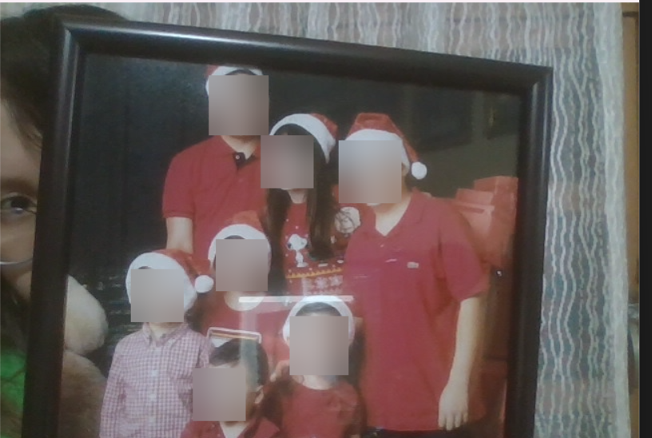

# Face Blurring Program

This project demonstrates real-time face detection and anonymization using OpenCV, it also explores the analysis and processing of video images using Haar's cascade algorithms to detect frontal and profile faces. As well as the use of filters that use a Gaussian convolution mask to facilitate the reading and identification of faces within an image.

## Target

It is designed to ensure privacy protection by blurring faces in real-time. Useful for cases where you want to hide the identity of people in a video, ensuring privacy protection with face anonymization.

## Features

- **Face detection**: Detects both frontal and profile faces using Haar cascade classifiers.
- **Face blur**: Applies Gaussian blur to anonymize detected faces.
- **User interface**: Displays the video in real time and allows closing the program by pressing the 'q' key.


## Example Use Case

Here is an example of how the program works: 



## Prepare the project environment

 **Prerequisites** 

Make sure you have the following dependencies installed:

- **Python 3.x** 
- **OpenCV**: Library for image and video manipulation.

## Installation

1. Clone this repository to your local environment:
   ```bash
   git clone https://github.com/callmedems/FaceRecognition_Project.git
2. Install the dependencies using `pip`:
   ````bash
   pip install opencv-python
3. Run the script

    `main.py` 

